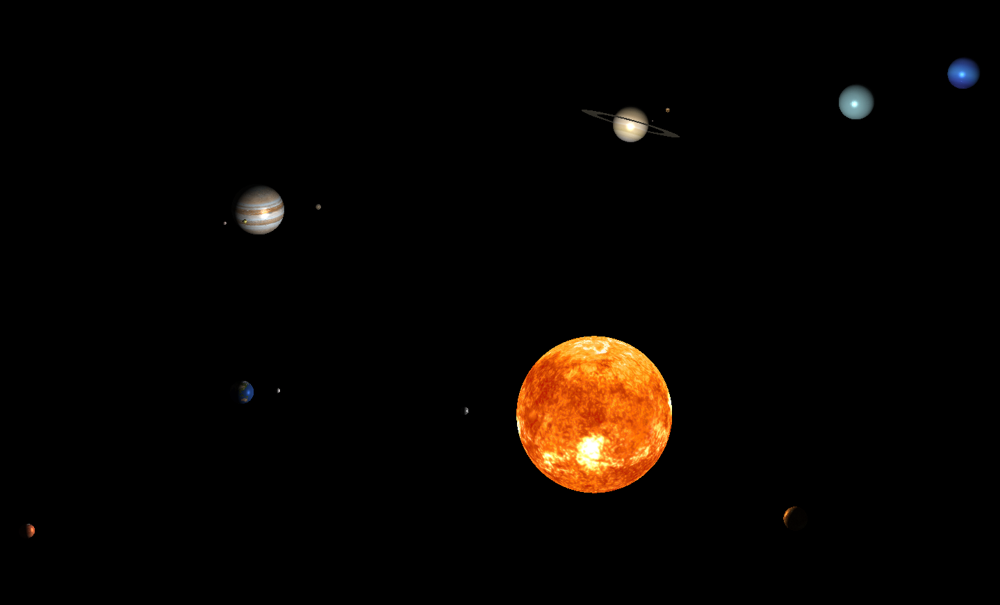

# Solar system simulation using OpenGL

This is a personal project to learn OpenGL.  
Given eccentricity, the trajectory for each planet is calculated from the Kepler's Equatation. Newton's method is used to get numerical positions.  

This project is still ongoing.

        
    demonstration image: demonstration 1

