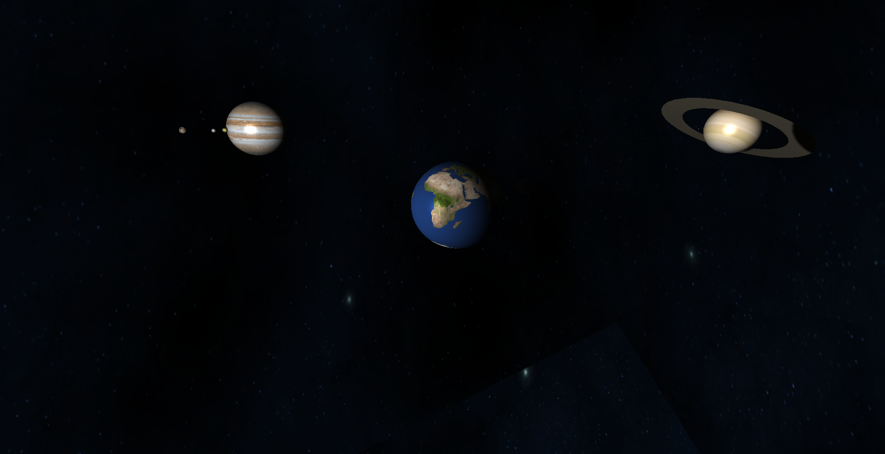
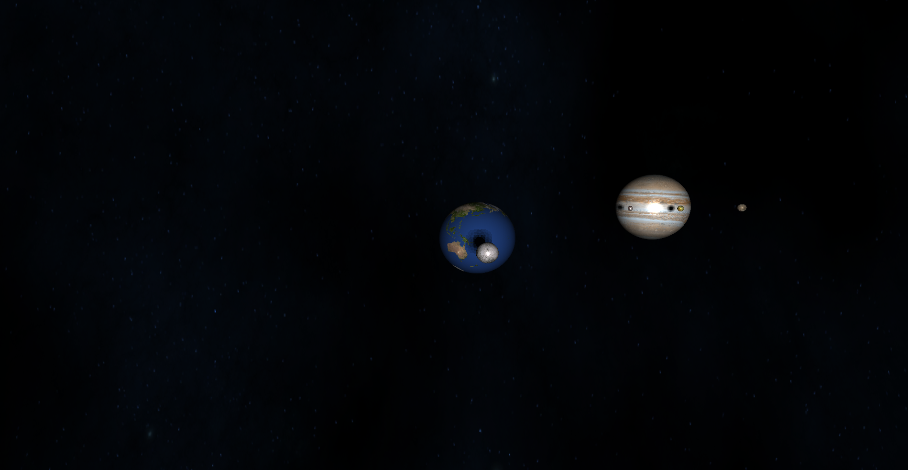

# Solar system simulation using OpenGL

This is a personal project to learn OpenGL.  
Given eccentricity, the trajectory for each planet is calculated from the Kepler's Equation. Newton's method is used to get numerical positions. The distances and scale for all celestial objects are disorted, while their revolution and rotation periods are proportional to the Earth's rotation period.

In order to visualize its 3D simulation more stereoscopically, a cube box and shadow effect is applied.

        
    Demonstration image: general view

To illustrate the eclipse effect, the omnidirectional shadow map is used in this project. The example images are below:

        
    Demonstration image: eclipse effect1 (The Moon is hidden bebind the Earth.)

        
    Demonstration image: eclipse effect2 (The Moon's shadow is expressed on the Earth's surface.)

